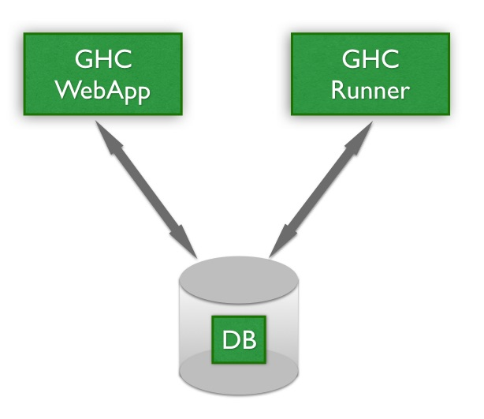

.. _architecture:

Architecture
============

GeoHealthCheck (GHC) consists of three cooperating parts as depicted in the figure below.

    *Figure - GHC Parts*

The **GHC Webapp** provides the Dashboard where users configure web services
(Resources) for (scheduled) health-checks and view the status of these checks.
The **GHC Runner** performs the actual health-checks and notifications,
based on what the user configured via the GHC Webapp.

The third part is the **Database** that stores
all information like users, resources, checks, schedules, results etc.

The **GHC Webapp** is run as a standard Python (Flask) webapp.
The **GHC Runner** runs as a daemon process using an internal scheduler to invoke the
actual healthchecks.

**GHC Webapp** and **GHC Runner** can run as separate processes (preferred) or
both within the **GHC Webapp** process. This depends on a configuration option.
If **GHC_RUNNER_IN_WEBAPP** is set to True (the default) then the **GHC Runner** is started
within the **GHC Webapp**.

A third option is to only run the **GHC Webapp** and have the **GHC Runner** scheduled
via `cron`. This was the (only) GHC option before v0.5.0 and will be phased out
as starting with v0.5.0, per-Resource scheduling was introduced and `cron` support
is highly platform-dependent (e.g. hard to use with Docker-based technologies).

Dependent on the database-type (Postgres or SQLite) the **Database** is run
within the above processes (SQLite) or as a separate process (Postgres).

So in the most minimal setup, i.e. **GHC Webapp** and **GHC Runner** running within
a single process and using SQLite as the database, only a single GHC process instance
is required.

Core Concepts
-------------

GeoHealthCheck is built with the following concepts in mind:

- `Resource`: a single, unique endpoint, like an OGC WMS, FTP URL, or plain old
  web link.  A GeoHealthCheck deployment typically monitors numerous `Resources`.
- `Run`: the execution and scoring of a test against a `Resource`.  A
  `Resource` may have multiple `Runs`
- Each `User` owns one or more `Resources`
- Each `Resource` is tested, "probed", via one or more `Probes`
- Each `Probe` typically runs one or more requests on a `Resource` URL
- Each `Probe` invokes one or more `Checks` to determine `Run` result
- `Probes` and `Checks` are extensible `Plugins` via respective `Probe` and `Check` classes
- One or more `Tags` can be associated with a `Resource` to support grouping
- One or more `Recipient` can be associated with a `Resource`. Each `Recipient` describes:

  * communication channel
  * target identifier

Data Model
----------

.. figure:: _static/datamodel.png
    :align: center
    :alt: GHC Data Model

    *Figure - GHC Data Model*

GHC Webapp Design
-----------------

The **GHC Webapp** is realized as a standard `Flask` web-application using `SQLAlchemy` for
ORM database support. It is the user-visible part of GHC as it runs via the
browser. Its main two functionalities are to allow users to:

* manage (create, update, delete) Resources, their attributes and their Probes and Checks, and
* view results and statistics of Resources (Dashboard function)

Deployment can be realized using the various standard Flask deployment methods: standalone,
within a WSGI server etc.

As an option (via configuration, see above) the **GHC Runner** may run within the **GHC Webapp**. Note that in case
that when the **GHC Webapp** runs as multiple processes and/or threads "Resource Locking" (see below)
will prevent inconsistencies.

GHC Runner Design
-----------------

The **GHC Runner** in its core is a job scheduler based on the Python library
`APScheduler <https://apscheduler.readthedocs.io>`_. Each job scheduled is a
healthcheck runner for a single `Resource` that runs all the `Probes` for that `Resource`.
The run-frequency follows the per-Resource run frequency (since v0.5.0).

The GHC Runner is thus responsible for running the `Probes` for each `Resource`, storing
the `Results` and doing notifications when needed.

The **GHC Runner** can run as a separate (Python) process, or within the **GHC WebApp** (see above).
Separate processes is the preferred mode of running.

Job Runner Synchronization
..........................

As multiple instances of the job scheduler (i.e. `APScheduler <https://apscheduler.readthedocs.io>`_)
may run in different processes and even threads within processes,
the database is used to synchronize and assure only one job will run for a single `Resource`.

This is achieved by having one lock per `Resource` via the table `ResourceLock`.
Only the process/thread that acquires its related `ResourceLock`
record runs the job.
As to avoid permanent "lockouts", each `ResourceLock` has a lifetime, namely
the timespan until the next Run as configured for/per `Resource`. This gives
all job runners a chance to obtain a lock once "time's up" for the `ResourceLock`.

Additional lock-liveliness is realized by using a unique **UUID per job runner**.
Once the lock is obtained, the UUID-field of the lock record is set and committed
to the DB. If we then try to obtain the lock again (by reading from DB)
but the UUID is different this means another job runner instance did the same but
was just before us. The lock-lifetime (see above) guards that a particular UUID keeps
the lock forever, e.g.  on sudden application shutdown.

To further increase liveliness, mainly to avoid all Jobs running at the same time when scheduled
to run at the same frequency, each Job is started with a random time-offset on GHC Runner
startup.

The locking mechanism described above is supported for SQLite, but it is strongly
advised to use PostgreSQL in production deployments,
also for better robustness and performance in general.
