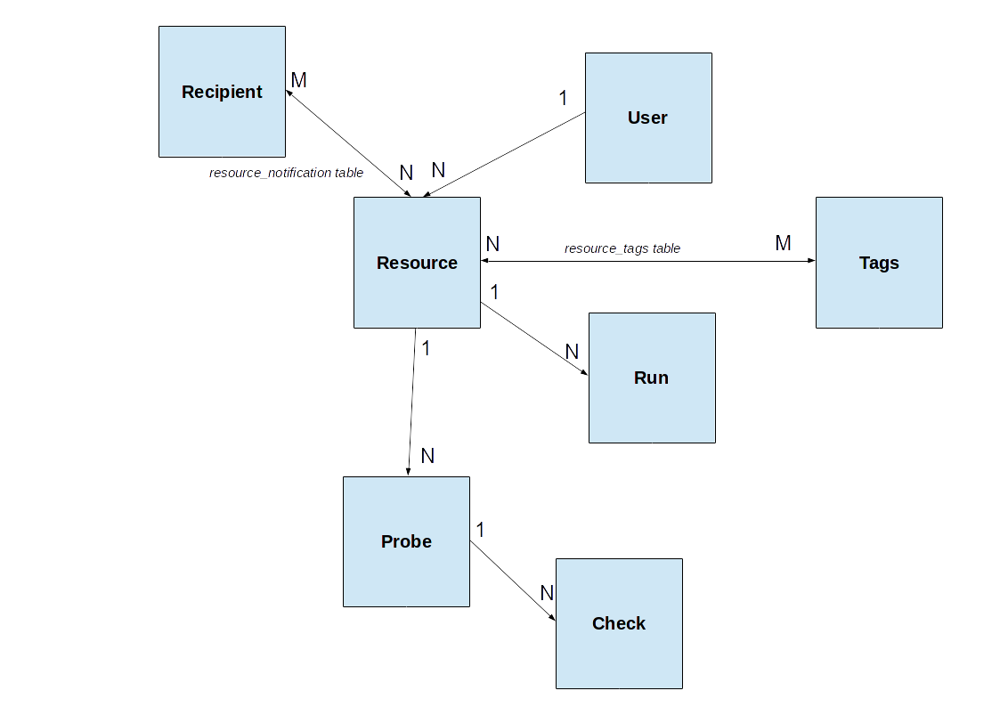

.. _architecture:

Architecture
============

(To be extended)

Core Concepts
-------------

GeoHealthCheck is built with the following concepts in mind:

- `Resource`: a single, unique endpoint, like an OGC WMS, FTP URL, or plain old
  web link.  A GeoHealthCheck deployment typically monitors numerous resources
- `Run`: the execution and scoring of a test against a `Resource`.  A
  `Resource` may have multiple `Runs`
- Each `User` owns one or more `Resources`
- Each `Resource` is tested "probed" via one or more `Probes`
- Each `Probe` typically runs one or more requests on `Resource` URL
- Each `Probe` invokes one or more `Checks` to determine `Run` result
- `Probes` and `Checks` are extensible `Plugins` via respective `ProbeRunner` and `Checker` classes

Data Model
----------

    *Figure - GHC Data Model*
