.. _userguide:

User Guide
==========

This chapter provides guidance for configuring GeoHealthCheck's (GHC) actual tasks: healthchecking
API services on (OGC) URL Endpoints. It is written from the perspective of the end-user who interacts
with GHC's webapp (UI).

This chapter contains figures of screenshots. Click on a figure to see a larger version of the image.
Use the back-button to get back into this document. This chapter can also be found by pressing
Help (top menu) within the Web UI.

Terminology
-----------

The following terminology applies:

- `Resource`: basically an endpoint URL, like an OGC WMS, FTP URL, or plain old weblink.
  For OGC-Resources this is always the root-URL, **not the Capabilities-URL**. Each Resource has a Type (see below).
- `Probe`: each `Resource` is tested via one or more `Probes`, a Probe is typically a single HTTP request, like `GetCapabilities`, `GetMap` etc. Each `Resource` (Type) has a default `Probe`.
- `Check`: each `Probe` invokes one or more `Checks`, typically on the HTTP response. For example if a WMS `GetMap` returns an image object.
- `Run`: the execution and scoring of a single `Probe`. Its `Checks` determine the `Run` outcome.
- A `Run` in addition has a single verdict: `Ok` or `NotOk`.
- Each `User` owns one or more `Resources`

The main user task within the web UI is to manage (add, update, delete) a set of `Resources`.
For each `Resource` its various properties (scheduling, notifications, tags etc)
and `Probes` is managed. Subsequently, for each `Probe` its various `Checks` are managed.

Registration
------------

If the administrator of the GHC instance has enabled User Registration (**GHC_SELF_REGISTER** = `True`),
any person can register and manage `Resources` on that GHC instance. A User can only manage its own Resources.
The Admin user can always edit/manage any `Resource`.

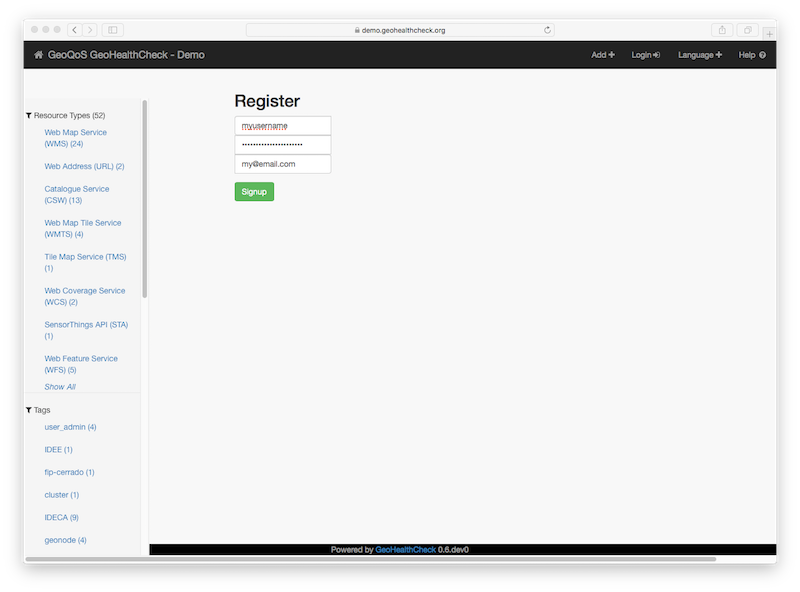

    *Registration*

Start registration by clicking Login in menu and then the *Register* link within the Login screen.
When registering, a working email adress is required if you want to receive Resource
notifications by email and for password-recovery.

Home Screen
-----------

The initial home screen always shows failing Resources (if any).
The badges on the top show percentages:

- *Operational*: percentage of all Resources that is currently "up"/healthy
- *Failing*:  percentage of all Resources that is currently"down"/failing
- *Reliable*: percentage of time that Resources are "up"/healthy within the retention window

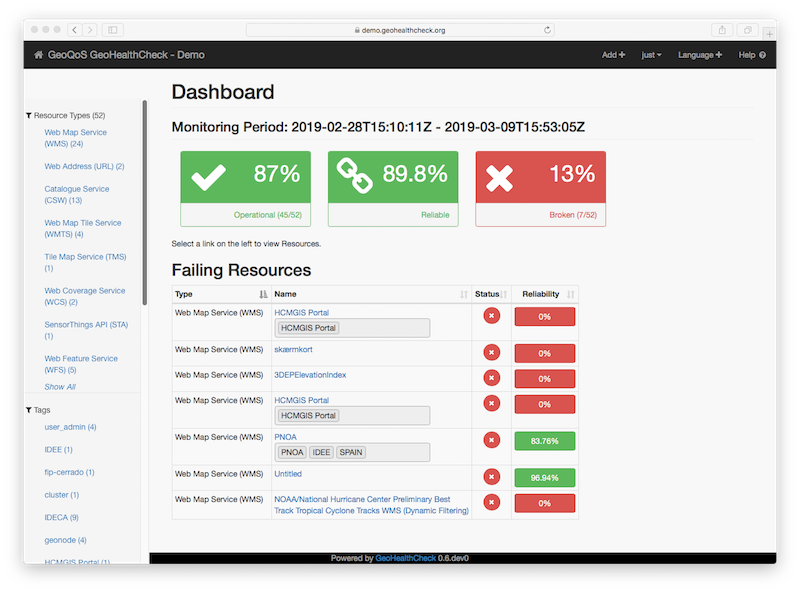

    *Home Screen*

Using the vertical menu items on the left different lists of Resources
can be shown: either by Resource Type (like WMS in Figure below),
or by Tags (discussed later).

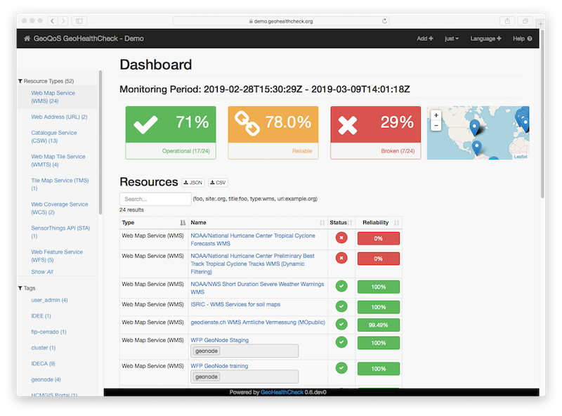

    *WMS Type Resource List*

Clicking the Home icon (top left) brings back the initial home screen.

Adding Resources
----------------

Click the Add+ button in the top menu to add a new Resource.

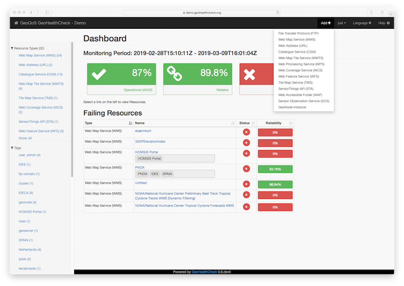

    *Add Resource - Select Type*

First choose a Resource Type from the dropdown menu.
The following Resource Types are available:

- Web Map Service (WMS)
- Web Feature Service (WFS)
- Web Map Tile Service (WMTS)
- Tile Map Service (TMS)
- Web Coverage Service (WCS)
- Catalogue Service (CSW)
- Web Processing Service (WPS)
- Sensor Observation Service (SOS)
- `SensorThings API <http://docs.opengeospatial.org/is/15-078r6/15-078r6.html>`_ (STA)
- OGC Features API (WFS3)
- Web Accessible Folder (WAF)
- Web Address (URL)
- File Transfer Protocol (FTP)
- GeoNode autodiscovery (see :ref:`geonode_notes`)

Next fill in the URL and optional tags for the Resource.

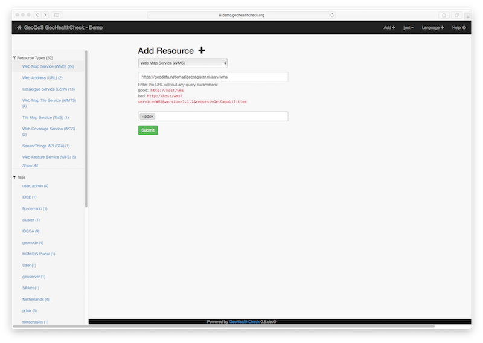

    *Add Resource - specify URL and optional Tags*

Fill in the endpoint URL, like an OGC WMS, FTP URL or a weblink for the Web Address Type.
For OGC-Resources **this should be the root-endpoint-URL, not the Capabilities-URL**.

You can add new or existing tags as well here. On Submit, the Resource will get a single
default Probe assigned. For OGC-Resources this is usually a `CapabilitiesProbe`.
If successful you are directed to the Resource Edit screen (see next).

Editing Resources
-----------------

Open the Resource details by clicking its name in the Resources list at the Dashboard/Home page.
Under the Resource title is a blue Edit button (if you own the Resource or as admin).
When Adding a Resource (see above), you are automatically directed to the Resource Edit Screen.

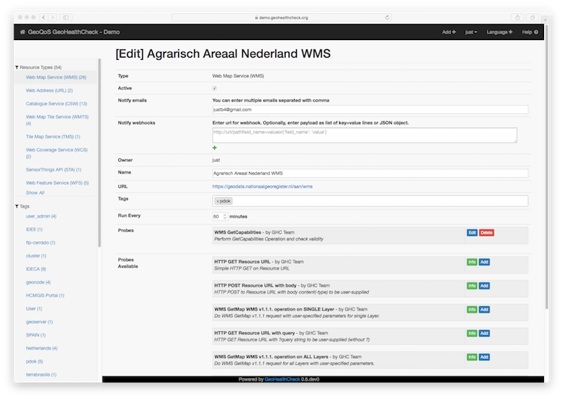

    *Edit Resource - Basics*

The following general aspects of a `Resource` can be edited:

- Resource name (initial Name may come from Capabilities or HTML `title` element if present)
- Resource Tags
- Resource active/non-active (makes Probes (in)active, e.g. when repairing a Resource)
- Notification: recipient(s) for email (see :ref:`notification_notes`)
- Notification: target(s) and parameters for webhooks (advanced: see :ref:`notification_notes`)
- Resource run schedule, "Run Every" N minutes
- Optional HTTP authentication (`Basic` or `Bearer Token`) for secured Resource endpoints

By default, when a Resource is created, the owner's email will be added to the email-notifications.

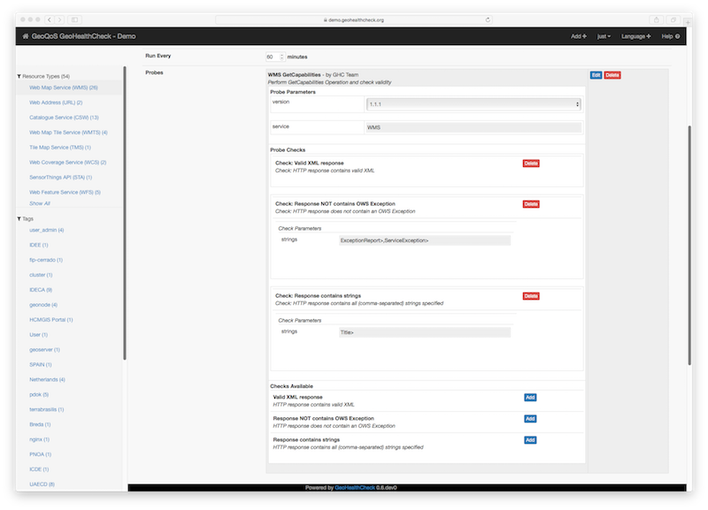

    *Edit Resource - Edit Probe*

The most important/functional aspects for a Resource are its Probes.

- Manage Probes for the Resource: select a Probe from "Probes Available"
- Optionally edit Probe parameters, fixed values have grey background
- Manage Checks for the Probe, add by selecting from "Checks Available"
- Optionally edit Check parameters

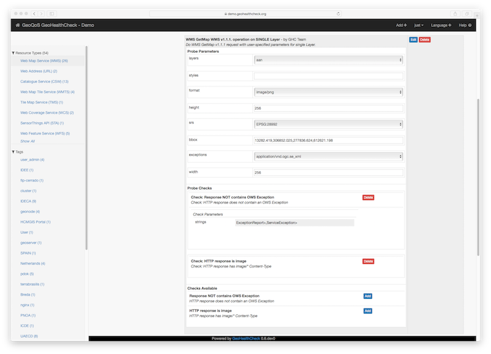

    *Edit Resource - Add Probe*

Note that all "Edit" buttons with Probes and Checks are toggles to show/hide a Probe and/or Check.

Click Save to save all Resource settings and then click Test to test your Probes and Checks.
NB Test only works on the Resource settings as saved! So Save, then Test.

Deleting Resources
------------------

Open the Resource details by clicking its name in the Resources list.
Under the Resource title is a red Delete button.

Tagging
-------

Each Resource can be tagged with multiple tags. This provides a handy way to structure
your Resources into any kind of categories/groups, like `Production` and `Test`, common servers any other grouping.

Failure Analysis
----------------

As history builds up for each Resource, Users may get notified, usually by email, when one or more Probes fail for a Resource
(and again when the Resource is healthy again). In this section we analyse a failing Resource (WMS).

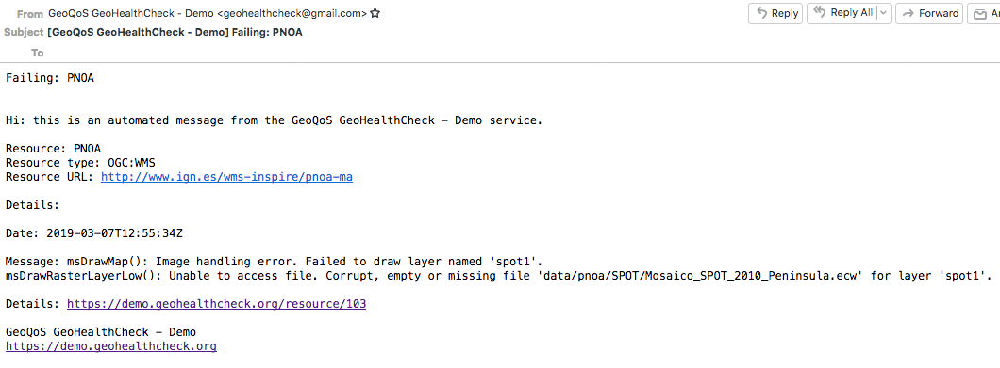

    *Email Notification - Failing Resource*

This kind of email is received when the Resource has failed.
We can already see in the message (showing the last message from one or more failing Probes)
that something is wrong with an `.ecw` (compressed raster image) file within the WMS.
We can click on the link to go directly to the Resource view within the GHC demo site.

NB: Dependent on the **GHC_NOTIFICATIONS_VERBOSITY** config setting, this email is received only
once on the first failure (False) or on each failing Run.

In order to analyse "what happened", the graph shown in the Resource view can be inspected.
Below, this WMS Resource is shown.

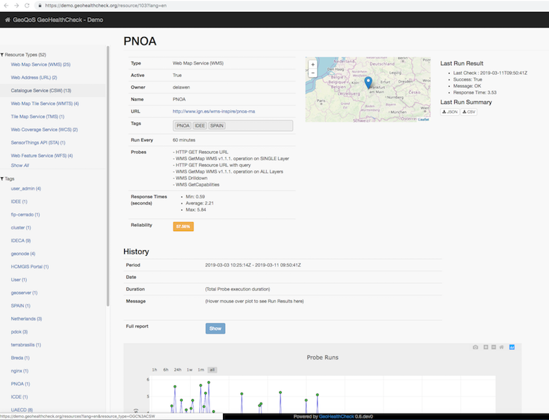

    *WMS Type Resource View*

As can be seen, this WMS Resource is now up (`Last Run Result` on top right) but has a Reliability of 57.56 percent.
This means that within the retention window (one week for the demo site) it has been down for about
half of the time. This Resource als has quite some Probes active, so is thoroughly tested each hour.

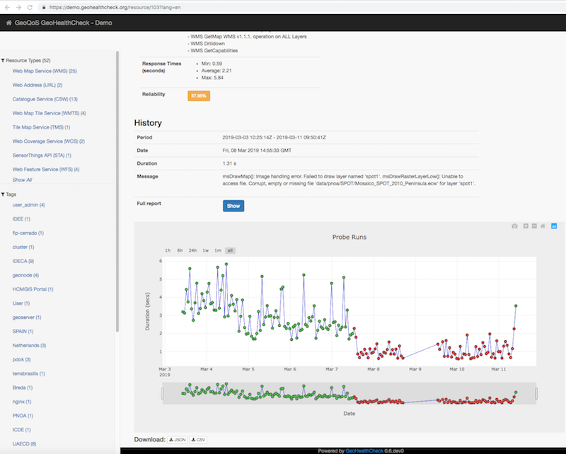

    *WMS Type Resource View - History*

Scrolling down within the Resource view the History Graph is shown. Each Resource Run is presented by a dot.
Red dots indicate that one or more Probes have failed in a Run. Green that all Probes gave success.

We see that this WMS has failed from somewhere on March 7, 2019 until March 11, 2019 when it became healthy again (last green dot right).
Also the Resource has been made inactive for some time during failure as no dots are shown.
The WMS itself may have been up though all the time! The is a classic case: the Capabilities Probe always succeeds, but more
detailed WMS GetMap Probes may have failed. We can inspect this in more detail from the history graph.

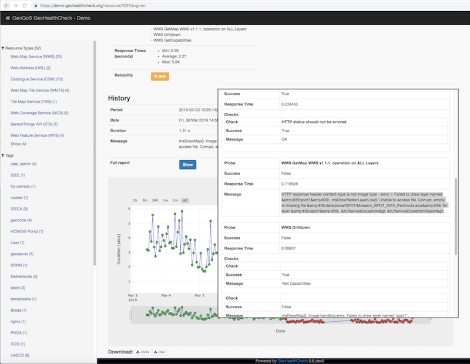

    *WMS Type Resource View - History Detail*

The History Graph can be explored in detail by simply hovering the mouse over its dots.
Also the graph can be zoomed in/out and panned, even with the mouse wheel.
For each dot the overall result is shown: Date/Time of Run, Duration (of all Probe runs), Message (Ok, or error message).
By clicking the Show-button the full Run report, i.e. all Probe and Check results for that Date/Time are shown
in a popup panel.

Here we can see more detail for this WMS: the WMS `GetMap` and two other WMS `GetMap`-related Probes like `WMSDrillDown`, have failed, because
an image file (.ecw file) could  not be opened/found. This is a classical example why you would need GeoHealthCheck: GetCapabilities
always succeeds on the service endpoint, but more detailed `GetMap` requests fail!

The last run within the history is again success, so apparently the underlying issues have been repaired and
the WMS is healthy again! For the last Run (green dot in graph), the email below is received.

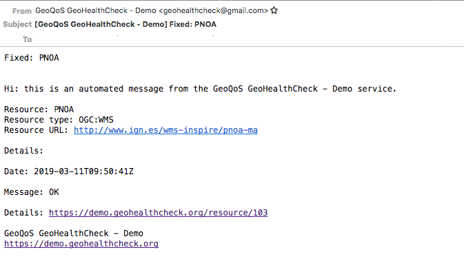

    *Email Notification - Resource Ok Again*

This kind of email is received when the Resource is healthy (Ok, True) again.

.. _notification_notes:

Per-Resource Notifications
--------------------------

Notifications for each Resource can be configured in the Resource edit form:

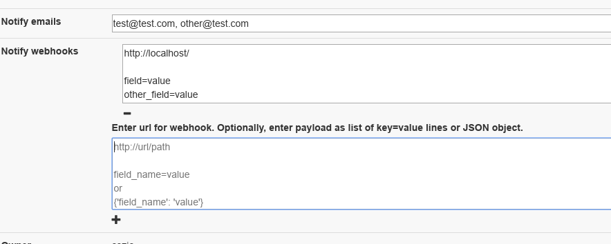

    *GHC notifications configuration*

Note: if left empty, the global (email-)notification settings will apply.

Two notification channel-types are currently available:

Email
.....

Notifications can be sent to designated emails. If set in the config, GeoHealthCheck will
send notifications for all resources to emails defined in **GHC_NOTIFICATIONS_EMAIL**.
Additionally, each resource can have arbitrary list of emails (filled in **Notify emails**
field in edit-form). By default, when a Resource is created, the owner's email is added to
the list. The editing User can add any email address, even for Users not registered in
the GeoHealthCheck instance. When editing an email-list for a resource, the user will get address
suggestions based on emails added for other Resources by that User. Multiple emails should
be separated with comma (`,`) chars.

Webhook
.......

Notifications can be also sent as webhooks (through `POST` requests). A Resource can have an arbitrary
number of webhooks configured.

In the edit form, the User can configure  webhooks. Each webhook should be entered in a separate field.
Each webhook should contain at least a URL to which the `POST` request will be send. GeoHealthCheck will
send following fields with that request:

.. csv-table::
    :header: Form field,Field type,Description

    ghc.result,string,Descriptive result of failed test
    ghc.resource.url,URL,Resource's url
    ghc.resource.title,string,Resource's title
    ghc.resource.type,string,Resource's type name
    ghc.resource.view,URL,URL to resource data in GeoHealthCheck

A webhook configuration can hold additional form payload that will be sent along with GHC fields.
Syntax for configuration:

 * first line should be URL to which webhook will be sent
 * second line should be empty
 * third line (and subsequent) are used to store the custom payload, and should contain either:
   * pairs of field and value in separate lines (`field=value`)
   * a JSONified object, whose properties will be used as form fields

Configuration samples:

* URL-only:

.. code::

    http://server/webhook/endpoint

* URL with fields as field-value pairs:

.. code::

    http://server/webhook/endpoint

    foo=bar
    otherfield=someothervalue

* URL with payload as JSON:

.. code::

    http://server/webhook/endpoint

    {"foo":"bar","otherfield":"someothervalue"}

.. _geonode_notes:

GeoNode Resource Type
---------------------

*GeoNode* Resource is a virtual Resource.
It represents one GeoNode instance, but underneath
auto-discovery is applied of OWS endpoints available
in that instance. Note, that the OWS auto-discovery feature is
optional, and you should check if your GeoNode instance has this feature enabled.

When a adding *GeoNode instance* Resource, you have to enter
the URL to the GN instance's home page.
GeoHealthCheck will construct the URLs to fetch
the list of OWS endpoints and create relevant Resources (WMS, WFS, WMTS, and other OWS Resources).
It will check all endpoints provided by the GeoNode API, and will reject
those which responded with an error.

All Resources added in this way will have at least one tag,
which is constructed with the template: *GeoNode _hostname_*, where *_hostname_*
is a host name from url provided. For example, let's assume you add GeoNode
instance that is served from `demo.geonode.org`. All resources created in this way
will have *GeoNode demo.geonode.org* tag.

Resource Authentication
-----------------------

Resource authentication allows a user to optionally add credentials to access a secured `Resource` endpoint.
Currently two (HTTP) authentication methods are supported:

* `Basic Authentication`: "classic" username and password based
* `Bearer Token`: single token based

The default is `None`, i.e. no authentication.

Within the `Resource` Edit screen, whenever a user selects an authentication method,
the related input form-fields are shown. Any credentials added are stored encrypted.

Resource Authentication has been implemented using GHC Plugins, thus may
be extended at will.

